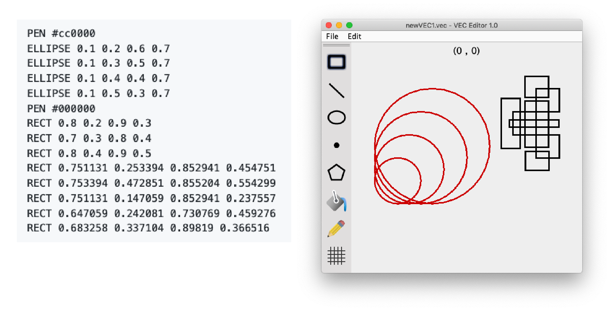
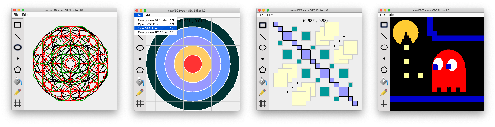

# Vector Design Tool (CAB302 Assignment 2)
This is a Java application for displaying and interacting with files containing proprietary design                                                                                                                                                                                                                                                           language called ‘VEC’. The graphical user interface was inspired by older tools like MS Paint, and uses a mixture of Java's Swing and AWT libraries. Users can load, create new files, edit, save and draw shapes with our plot, line, rectangle, ellipse, and polygon tools (as well as choose outline/fill colours). It has additional functionality for snapping to a user-defined grid, BMP image export and undo history support.

VEC drawing commands can have the form of `LINE [x1][y1][x2][y2]`, where the parameters are coordinates of the drawing operation. An example file could contain and display the following in the GUI:

More examples:

## Authors
- [@benjaminbrewerton](https://github.com/benjaminbrewerton)
- [@Sienna-Cowen](https://github.com/Sienna-Cowen) 
- [@phoebelestrange99](https://github.com/phoebelestrange99)
- [@g4b-y](https://github.com/g4b-y)

## Source Code
Unfortunately the source code cannot be released publicly, due to [QUT’s academic policy](http://www.mopp.qut.edu.au/C/C_05_03.jsp#C_05_03.06.mdoc). However, I am happy to provide prospective employers with a unique link to the private repository.
